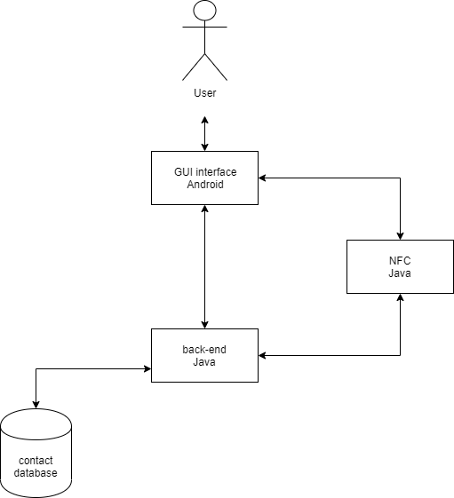
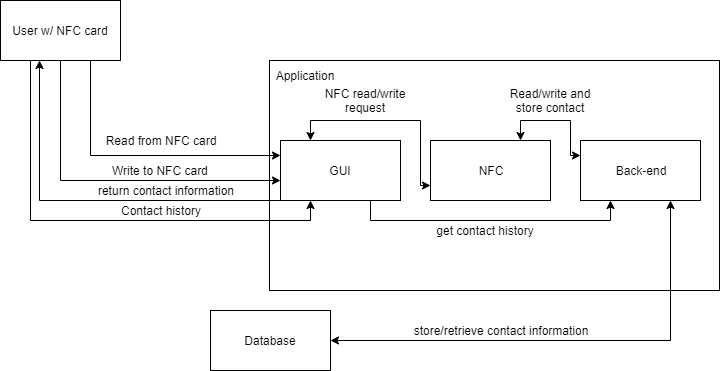
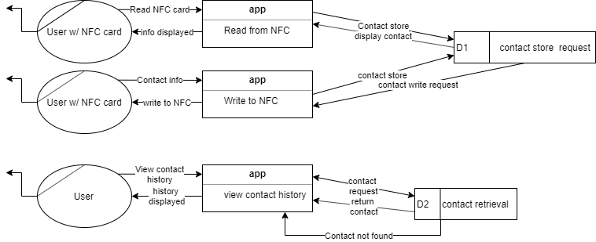
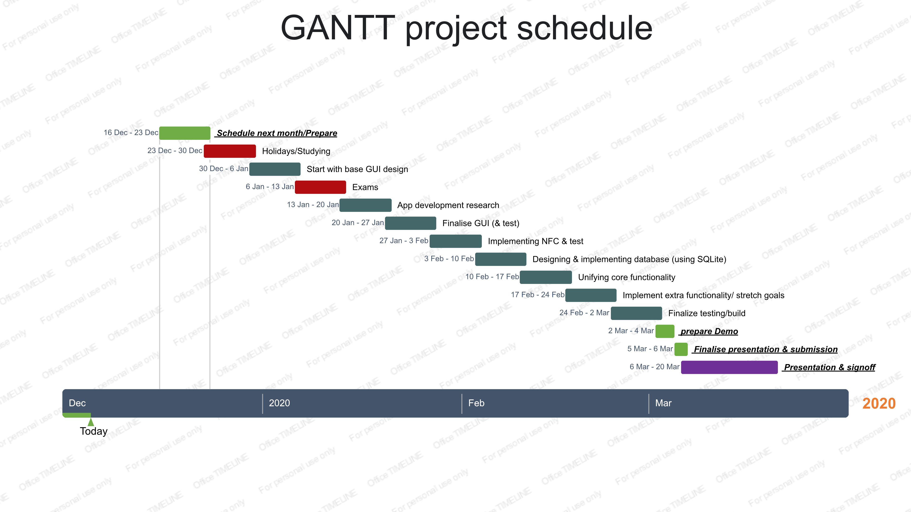

# **0. Table of contents**

| Section   | page
|:-----------|:-------|
|**1. introduction**| |
|1.1 Overview|2 |	
|1.2 Business Context|2 |
|1.3 Glossary|2 |
|**2. General Description**
|2.1 Product/ System Functions	|3 |
|2.2 User Characteristics and Objectives|4 |
|2.3 Operational Scenarios|4 |
|2.4 Constraints|5 |
|**3. Functional Requirements** |
|3.1 GUI Functionality |6 |
|3.2 NFC Functionality |7 |
|3.3 Database Functionality |8 |
|**4. System Architecture**|8 |
|**5. High Level Design** |
|5.1 Context Diagram |9 |
|5.2 DFD Diagram |10 |
|**6. Preliminary Schedule**|
|6.1 Diagram |11 |
|**7. Appendices**| 
|Extra relevant Information |11 |

# 1. Introduction
### 1.1 Overview
This functional specification entails the development of an NFC reader/writer application (titled “CardConnect”) developed by Abe Grogan and Luke Edgeworth. It is being designed for the need of modernising the idea of business cards, by using NFC as a way to transfer contacts between business associates. It’s main function will be reading and writing contact data to an NFC tag, and allowing the user to transfer their data through the card, and saving contacts read in by the app. Contacts that are not saved to contacts are kept in an in-app database, giving a history of received contacts.
### 1.2 Business Context
Provides an overview of the business organization sponsoring the development of this system / product or in which the system / product will / could be deployed. Note - may not be applicable to all projects (won’t need?)

This software could be deployed in conjunction with on-site projects/contracts wherein an on-site employee contracted out to a different company could bring their NFC business card to their on-site working environment and easily disperse their contact information among the sites co-workers. The Business card could be carried on a lanyard that could, if required, be scanned by co-workers in other departments in the company that may circumstantially be required to be in contact with the outsourced employee.

The NFC business card could also be used by people prospecting for a new job, giving them the ability to leave their contact information with a companies front-desk receptionist speedily, granting the receptionist the necessary contact information without having to read through their emails, this removes unnecessary bureaucracy. 

An average NFC type 2 card costs 50 cent, while a normal  paper business card costs 45 cent. Given the reusability of an NFC business card, which can be scanned thousands of times, compared to a normal business card, which would be given away once and likely held by the recipient indefinitely, our product can be expected to cut the costs of a business' expenses on business cards long term.
### 1.3 Glossary
**NFC** - Near-field communication. A set of communication protocols that allows for two electronic devices to establish a connection and exchange data between them without a wired connection.
**GUI** - The Graphical User Interface. This is the method in which users can interact with a program through the use of objects drawn onto the users screen such as text boxes, buttons, graphical icons, animations etc.
**Database** - A database is an organized collection of data, commonly used in computing. 
**SQLite** - SQLite is a relational database management system.
**XML** - Extensible Markup language, a markup language that defines a set of rules for encoding documents in a format that is both human-readable and machine-readable.

# 2. General Description
### 2.1 Product / System Functions

##### NFC Functionality
The app’s main function is to give the user the ability to input contact information such as email, phone number, name and photo, and other information into the device and store it as a contact file. This contact file would only be measured in bytes and would never pass a kilobyte, due to the restraints of the contact information and the size limits of most NFC tags.The user can then write the information to a NFC card/tag, and then be able to read again by the app .The app will interact with NFC tags, using NDEF (NFC Data Exchange Format) as a standard, and type 2 tags for our testing. This is the optimal type and most widely used tag, due to its bae memory (bigger than type 1) and it‘s read and write speed (between 106-424 kilobits per second, which is the standard speed of tag types 2-4). If there is time for stretch goals, extra functions will be added, such as adding url/uri and images to the nfc card, formatting tags, locking tags permanently.

##### Database Functionality
Whenever a user reads a contact from an NFC card, it will be placed in the ‘Contact history’ section of the app. These contacts will be placed in an in-app database.
When a user tries to enter the “Contact history” section in the app, a list of contacts previously read will pop up. This will query our database to present each contact entry in a list for the user to view. This section will give the user the ability to delete entries in the list or save it to the contacts app on their phone. If the user does this, the app will redirect the user to the contacts and the data will provide the contact entry to which the app will import into the users contacts.

##### GUI functionality
The GUI for the application will be split among a number of different screens being:
1. *__Home screen__*
* Read from NFC card (button)
* Write to NFC card (button)
* Contact History (button)
2. *__Read from NFC card screen__*
* Present NFC card (dialog box)
* Contact information (text)
* Save to Contacts (button)
3. *__Write to NFC card screen__*
* Name (field)
* Phone number (field)
* Organisation (field)
* Website (field)
* email (field)
* Notes (field)
* Write (button)
* cancel (button)
* Present NFC card (dialog box)
4. *__Contact History screen__*
* List of contacts (list representation and button)
* Contact list entry (button)
* Save contact (button)
* View Contact screen
* Contact information (text)
* Delete (button)
* Save contact (button)

The GUI will be displayed using xml in the app to the user with the backend of the app being implemented with the Java programming language (written using the IntelliJ environment).

### 2.2 User Characteristics and Objectives
We expect that the user demographic would be in a traditional business setting that would require open communications and networking. There could also be a fringe minority in our demographic that would be freelancers (such as artists) who use business cards in order to advertise their practice and skills. The age of our demographic would range in the 25 to 60 range, since this is the rough age of business owners and employees work from the beginning of their employment(possibly after college) to their retirement. Because of this gap in the expected age we believe that the technical capabilities of our users will differ greatly. As such we plan to make our application easy to use and simple in design. We believe the cognitive aspect of our users would be able to utilise a smartphone, including using the app and enabling NFC on their device.
### 2.3 Operational Scenarios
*__User opens the app__*
When the user taps the app icon, it will start the app and bring them to the main screen, with the two prominent buttons “Read from NFC card” and ”Write to NFC card”. It will also feature and “history” button, which will contain your previous business card scans.
*__User reads card__*
The user taps the “Read from NFC card” button and the app presents a dialog page asking them to tap a card onto the phone. When the user taps a card, they are brought to a page that displays the contact information of the card and an ability to save the contact information on the card with the ‘save’ button.
*__User writes to card__*
The user taps the “Write to NFC card” button and the app presents a dialog page asking them to write their desired contact information onto the phone. This includes their name, address, phone number, email and extra notes regarding the contact. After the user writes the information and taps, the ‘write’ button, the app will ask them to tap their card onto the phone.When the user taps their card, the app will write to the NFC card and confirm it.
*__User saves contact__*
The user taps the save button when they’ve read a contact or pick a contact from their history, then the app will transfer them to their phones contact app and import the contact information for them to save onto the phone.
*__User views contact history__*
If the user presses the ‘history’ button, the app will display a list given from the in-app database of previous contacts read by the card. It will also give them the option to save or delete specific contacts they’ve previously read.

### 2.4 Constraints
*__Time constraints__*
This project is due at the end of the second semester of 2019/2020 academic year. This could prove to be a limiting factor as to how well extensively completed the finished the project will be.

*__Knowledge gaps__*
The usage of unfamiliar software (android sdk) may prove time consuming while learning this new software throughout the year. Our knowledge with Java is not as extensive as our knowledge of Python, but is still comprehensive enough to overcome most major differences between the two languages. We must also use a SQLite package to implement our database for storing contact history, which may require some time to learn.
Technological Requirements
It may be difficult to implement a database for our app to be fully functional and support a working interaction with the user as per this document.
# 3. Functional Requirements

### 3.1 GUI Functionality

*__Description__*

The Front End GUI must be easily readable and intuitive for the user, since our target demographic spans the age range of working adults (~21 - 65), whose aptitude at modern software may vary. The GUI must give the user the ability to easily change, create, view and obtain a given cards information, this will be achieved via the “Read from NFC card”, “Write to NFC Card”, and “Contact History” buttons.

*__Criticality__*

This Functionality is essential to the apps development, if the app’s final GUI proves to be difficult for the average user to use, the premise of our app being an easy way for contact information to be viewed, exchanged and created becomes nullified. 

*__Technical issues__*

Other than having to become competent at XML, which should not be an issue due to its likeness to other languages we have learned like HTML and CSS, this requirement contains little Technical issues from our perspective.

*__Dependencies__*

The GUI will link to both the NFC and back end of the app. The GUI will supply the user the ability to read and write to the NFC functionality of the app, and supply the user the information stored on the back-end of the app (the stored contact information of other users).

### 3.2 NFC Functionality

*__Description__*

The NFC functionality of our app must be able to read and write information from/to NFC cards (type 2) applied to the reader (with our project we will use our phones NFC readers).  The NFC segment will take information supplied from the “write to NFC Card” part of the GUI and transfer the information to the NFC card. The NFC segment will also read information off the card from both the “write to NFC Card” part of the GUI and store it within the Database section of our app.

*__Criticality__*

Our project will not be complete if we are unable to properly read/write from and to NFC cards. Our project is based on the ability for information to be read off of the cards. Failure to implement either one of the reading and writing aspects of this segment will severely hamper the functionality of our app.

*__Technical issues__*

As we have tested in our feasibility study, the average size of the information put on to the cards is 150- 440 bytes, depending on the media type(contacts, urls, etc.). Exceedingly long entries into the information fields could hypothetically slow down/break the reading of its information, however this is unlikely. Working with NFC cards type 2 and above however nullifies the chances that too much information would be written to the card, due to the base memory standards placed on such tag types.

*__Dependencies__*

The NFC segment of code will form the core of our app, this segment will interact with both the front and back end of our app, feeding the information read to the back end while also taking given inputs from the GUI to write to a blank NFC card.

### 3.3 Database Functionality

*__Description__*

The Database segment of our app must be able to store previously read cards information to the app and make it accessible for the users to view and change. The database will be instrumental in giving the users the information they desire, which will require that our database can, with near certainty, always return all the data stored on the app. Failure to do so would result in an app that cannot save previously scanned cards information, which would reduce the workplace relevance of the apps intended purpose. If the user chooses, they should be able to view the contact information stored in the database and import contacts directly into their contacts app and google contacts.

*__Criticality__*

The Database end of our app must be implemented correctly because if an incomplete or empty list of contacts in contact history is returned when the user has a list of contacts, the utility of the app is severely hampered.

*__Technical issues__*

We will have to import the android.database.sqlite package (version 3.8) to implement the database with our app. Learning and coding the packages functions may take some time for us to learn. We will also have to figure out how to interact with the contact apps to import the business card’s information. We may have to gain root access into our phones in order to test this fully.

*__Dependencies__*

The Database segment will be strongly related to the GUI component of our app, since we will need to display the contact information directly to the GUI, displaying a list of contacts which can be opened and viewed more in depth. The Database segment will also need to read in new contacts and store them from the NFC segment. The back-end will mainly function as a way to pull this information from the database and feed it to the GUI.

# 4. System Architecture
This is the proposed architecture for how the app will interact with its users.
The system will be composed of
The GUI layer displaying the user information, like contacts and options in app, displayed by the android XML
The NFC layer, which is used to read and write information from these cards to the phione and vice versa. This will utilise the NFC package stored in the android library.
The back-end layer, which is the main process of utilising both layers to do their respective jobs, which is coded in java. 

# 5. High-Level Design
We utilised some SSADM techniques to generate the high-level design of this system. This includes:

*__Context Diagram__*
This diagram depicts how the different entities from outside of the system(user) interact with the core system.

*__DFD (Data Flow Diagram)__*
This high level diagram details most of the flow of data that will occur within the application. This data will consist mostly of text travelling from the user to the database.

# 6. Preliminary Schedule

# 7. Appendices
*__NFC Forum__*
https://nfc-forum.org/what-is-nfc/

*__Java__*
https://go.java/index.html?intcmp=gojava-banner-java-com

*__XML__*

https://www.w3schools.com/xml/xml_whatis.asp

