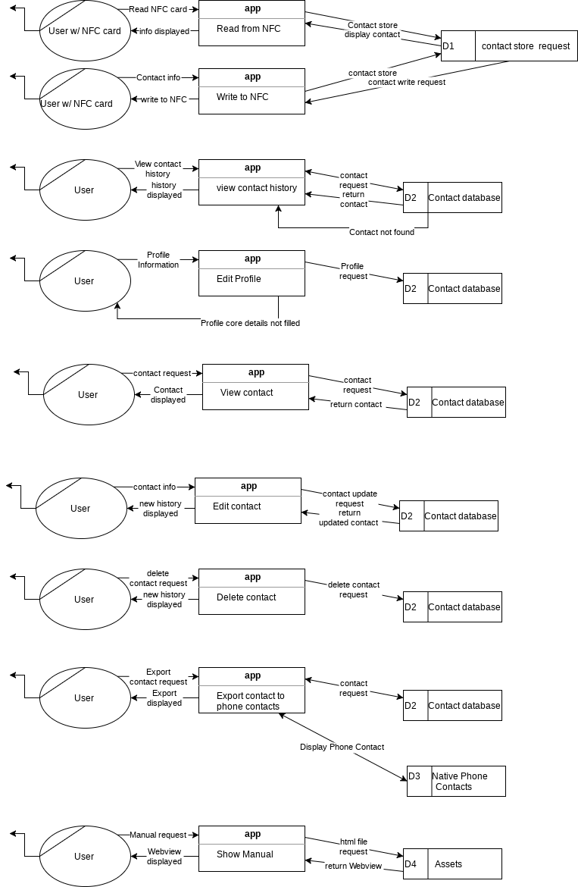

# **0. Table of contents**

| Section   | page
|:-----------|:-------|
|**1. introduction**|
|1.1 Overview |1 |	
|1.2 Glossary |1|
|**2. System Architecture**|
|2.1 System Architecture |2 |
|**3. High Level Design** |
|3.1 Context Diagram |4 |
|3.2 DFD Diagram |5 |
|**4. Problems and Resolution** |
|4.1 Problems and Resolution |7 |
|**5. Installation guide** |
|5.1 installation guide |8 |

# 1. Introduction

### 1.1 Overview

This technical specification entails the development and finalisation of an NFC reader/writer application (titled “CardConnect”) developed by Abe Grogan and Luke Edgeworth. It is designed for the need of modernising business cards, by using NFC as a way to transfer contacts between business associates.The app’s main function is to let a user create a profile for themselves or their business, where they can write that information to a NFC tag for other app users. Those Users can read the contact data(consisting of multiple fields such as name, phone, email, address, position in an organisation, website, etc.) from the NFC tag, allowing the user to transfer this data to the app’s contacts (which is read in by the app, and stored into a SQLite database).

 The user can then view those Contacts, and have the option to delete them from the database, or edit them when business colleagues change their contact information. The other Contacts can be viewed and picked from a list of received contacts.  If the user would want a contact to be more personal, they can interact with the native Contacts app to export an entry from the database into their phones Contacts, this contact would include all fields from the database contact. The user can also view the user manual from the app.

### 1.2 Glossary

**NFC** - Near-field communication. A set of communication protocols that allows for two electronic devices to establish a connection and exchange data between them without a wired connection.

**GUI** - The Graphical User Interface. This is the method in which users can interact with a program through the use of objects drawn onto the users screen such as text boxes, buttons, graphical icons, animations etc.

**Database** - A database is an organized collection of data, commonly used in computing.
 
**SQLite** - SQLite is a relational database management system.

**XML** - Extensible Markup language, a markup language that defines a set of rules for encoding documents in a format that is both human-readable and machine-readable.

**GPS** - Global Positioning System. This provides geolocation and time information to a GPS receiver anywhere on or near the Earth where there is an unobstructed line of sight GPS satellites.Obstacles such as mountains and buildings block the relatively weak GPS signals.

**Geocoder** - This is an android package used to take Coordinates given from the GPS and turn it into an address, or vice versa.
 
**ContactsContract** - Android package used to help insert entries into contacts via a table. CommonDataKinds is also used to edit the type of data you put into the entries.

**SharedPreferences** - Android package that simply holds data for specific activities, such as text fields

# 2. System Architecture

Our System Architecture plan in our functional specification remains primarily in-line with our final resulting architecture.

The System Architecture is composed of a front-end GUI which is written in Android XML, which is constructed using the xml files located in the **res/drawable/layout** directory. The buttons are designed in their respective “activity_(blank).xml ” file, for example activity_edit_contact.xml contains all of the design presets for text fields within the editContact Java class. These designs are then invoked by the editContact Java class and 
Creates the button. E.g editContact creates the button by importing the layout from activity_edit_contacts.xml and initialising it.

The back-end Java consists of the methods that help connect the front-end to the database, this is demonstrated by the SaveDetails() method in editContacts. This method takes the strings inputted into the textFields by the user, and calls a method from DatabaseHelper that will find the entry in the database that the user wishes to be updated, and enters the new information inputted by the user,  it will then move back to working with the front end by calling a new intent for the user, bringing them to the view with their lists of Contacts, with it being updated.

User (inputs data) -> TextField (stores data temporarily) -> Save Contact (calls SaveDetails() method) -> SaveDetails(calls UpdataData in DatabaseHelper to update the database). -> updateData (access and writes to database) -> new intent -> (returns to Contacts view with updated list).

Contrary to our functional spec’s vision, most of our classes are highly coupled with the database for our application uses, since our application revolves around the data the user enters and receives. Our classes ultimately require a query back to the database to display the data stored, we initially started development using the “Shared Preferences” module of java to share data between classes, however we were concerned with the possible low cohesion resulting from using it,which would make the data between the gui and the back end asynchronous since we’d be required to keep track of both the Databases data and the Shared Preferences data at most points during the applications execution, so we decided to read and write directly to the Database instead. 

The NFC and GUI fragments both require queries from and to the database for most of their functionality to be fulfilled, the NFC fragments require the ability to read the users profile data from, and write the users profile data to the database. The user’s ability to edit data starts from the editContact class, which displays the current data stored in the database, and upon editing will require writing to the database. For the scope of this app however, the tight coupling presents minimal problems for the user and simplified our app development.  

# 3. High-Level Design
We created some SSADM diagrams to help illustrate the high level design of our project.

*__Context Diagram__*
This diagram depicts how the different entities from outside of the system (users) interact with the core system. The user will mostly interact through the app via the GUI, which will interact with either the nfc to read the user tags or the back end, which interacts with the native phone contacts for exporting, the database for storing contacts, and the location manager for getting a location if the user wants it.

*__DFD (Data Flow Diagram)__*
This high level diagram details most of the flow of data that will occur within the application. The main use cases for the data flow would include creating and editing the profile, reading and writing to NFC, viewing contact history, viewing, editing, deleting and exporting specific contacts and presenting the user manual.
 This data will consist mostly of text travelling from the user to the database. There can also be transfer of data to assets for the user manual and the native phone contacts for exporting contacts as separate data stores.

# 4. Problems and resolutions

__Shared Preferences vs writing to database__: Initially we used the Shared Preferences module to share data between the respective classes of the project, however we realised with the size of our database and the amount of classes that require access to the database’s data that Shared Preferences was not ideal. We recognised this from the fact that while developing the app, we were essentially making a copy of the data before sending it on to the database, and since shared preferences and the database where not synchronous in data transfer, we could come across errors where a user could enter a name but not fully saving to the database, thinking they had changed it.

__Database errors__: When creating the database, we came upon a few roadblocks in terms of optionality. Our NFC write fragment was unable to write an entry with empty columns in the database to the users NFC card properly . Since every entry in the database that wasn’t filled by the user was recorded as null, and our NFC cards work off of using “text plain” as their format, any empty field would be recorded on the card as the string “null” instead of a blank. We solved this using the way we formatted the messages. We separated each piece of data using the ‘~’ character (since it is realistically never used for the contact data in the scope of our app), split the data into an array, and replaced each “null” entry with an empty string. This helped with having our contact textView be more dynamic by removing empty entries.

__ListView Errors__: We had a problem where the dynamic view of the list of contacts would display the list of read contacts, however, upon clicking on the entry the app would crash with a nullPointerException. This was due to an indexing error in relation to our database. Each entry had a unique ID, however, it was set as an autoincrement key. As a result, whenever we deleted an entry. If the 3rd entry was deleted, the ID for the 4th entry should’ve become the 3rd’s, however autoincrement prevented this, and resulted in mismatched indexes. To work around this, we created a list that referenced the ID attribute of each entry in the list, in correspondence to the List view entries.

For instance, if the first entry displayed in the contact list was originally created with the ID primary key as “4”, the first entry in the list would contain “4” ([“4”,”7”,”9” etc]), the list would then be indexed by the fetch function, so that when the first entry is clicked, it passes “4” to the retrieval function that accessed the database, to display the correct information. This also helped with deleting entries in the database and updating the listView

__Website Export Difficulties__: As part of our export functionality, we port every attribute of a contact to the “contacts” app native to android devices. We encountered an issue where the contacts app wasn’t able to directly insert the website field into the contact field. To work around this, we worked with a package method for ContactsContract called “CommonDataKinds”, and were able to utilise it to properly import the website into the website field in contacts when the contact app is opened upon export.

__Location Issues__: The Location functionality of our app produced some difficulty initially. Firstly, we had to set up a **requestPermissions** prompt upon startup of the application, since it contains private information. The Location permissions also interfered with the UI testing as Android studio was **unable to call the request permissions** while emulating and running the tests, but since they weren’t the target of our tests in the files we were testing, we removed the requests while we ran the tests. We originally tried to use the **location packages** in the DatabaseHelper class, however we required the class to extend **“LocationManager”** while DatabaseHelper needed to Extend **SQLiteOpenHelper**, to remedy this, we created a separate class called LocationManager that took the location information and fed it into the Database instead of directly writing to the Database. This way we could keep the class seperate for other uses if need be and we could get coordinates and place the gecoder address into a variable to give the database.

# 5. Installation guide

Users must use a device that uses Android as its Mobile Operating System, with a **minimum** Android version of **4.4 (KitKat)**, (as our applications minimum **API level** is **19**). Versions **above 4.4** are compatible with our application as well, except for “Pie”, the most recent Api release (Api 28) which is version 9.0 of Android. The range of compatible api levels is **19-27**.

In order to use the application’s “location” function, you must have a device with **GPS hardware** and have to have location enabled on the device.

User’s devices must contain an **NFC chip** that can **read and write** from/to an NFC card. Most Android phone producers have included NFC chips within their phones since 2012. See for information about NFC compatible Android devices. To enable NFC, you can access the quick settings menu and enable NFC on your device.

To install our application, **download** the apk file uploaded on our **Gitlab** directly onto your device, **or transfer** the file from a PC to your device using an appropriate cable. Upon transfer or download, the app should **automatically** install itself onto the device and pop up as an icon on one of your devices home screen menus, if it doesn’t, simply run the apk file on your device to install. Once it’s installed, you can tap on the app icon to use it.

