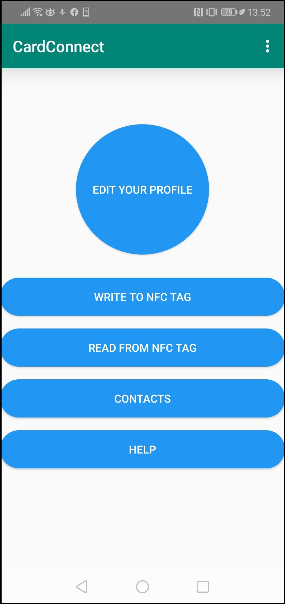
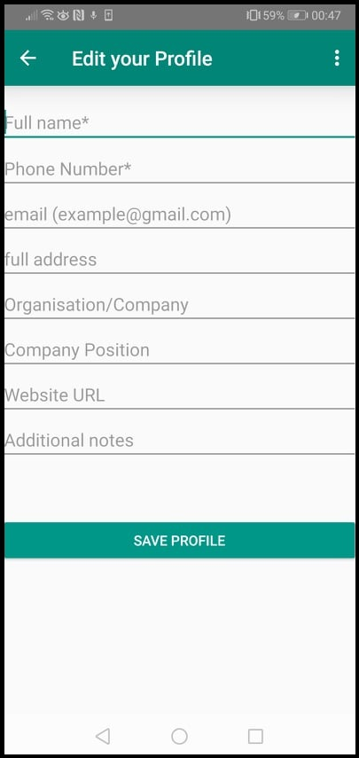
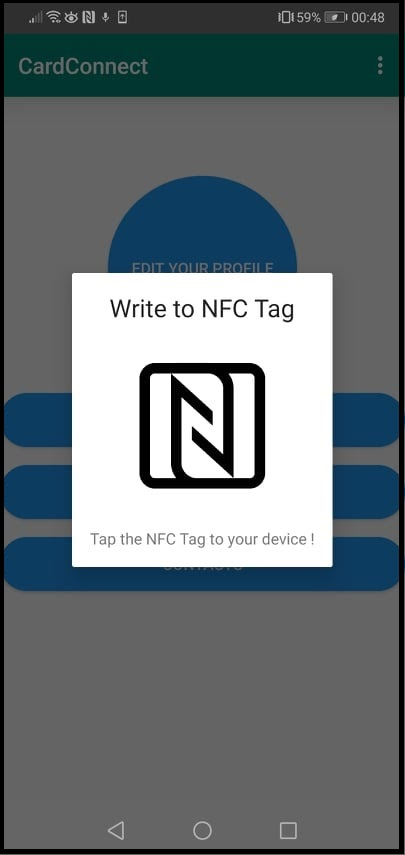
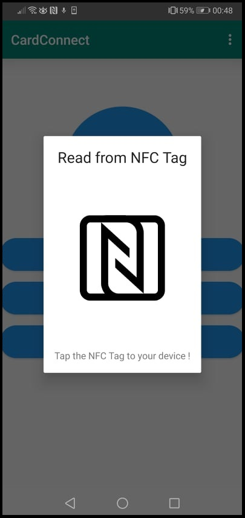
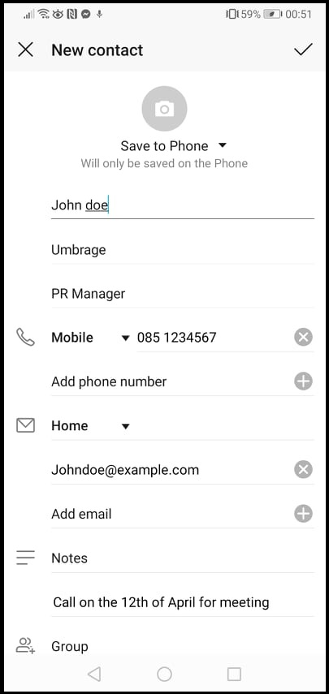

# CardConnect User Manual

**Abe Grogan - 17314893 and Luke Edgeworth - 17509283**

### **Introduction**

This is our User manual for our third year application called CardConnect. CardConnect is an NFC based business card application designed to encapsulate desired contact information within a database that is easily accessible to the user, which contains their own contact information (which can be edited by themselves), and other people’s contact information. The database our application uses can store as many entries as the storage on the device allows, given the relatively small size of each entry storage-wise, users can be confident that they can store as many contacts as they require.

### **Requirements** 

User’s must use a device that uses Android as its Mobile Operating System, with a minimum Android version of **4.4 (KitKat)**, (as our applications minimum **API level is 19**). The version of an android device is typically shown within **Settings -> System -> About Phone** on a phone. Versions above 4.4 are compatible with our application.

User’s devices must contain an **NFC chip** that can **read and write** from/to an NFC card. Most Android phone producers have included NFC chips within their phones since 2012. To check if your device has NFC capabilities, open **Settings -> Device Connectivity**, and check if NFC is an option. See [here](https://www.bluebite.com/nfc/android-nfc-compatibility) for information about NFC compatible Android devices. To enable NFC, you can access the quick settings menu and enable NFC on your device.

To store your contact data, a **blank NFC card** is initially required to be written to, at which point afterwards it will store your contact data for other users to scan and store. The NFC tags we recommend for usage is any card type with **over 200 bytes** of data storage, as the average contact data with all fields filled contains ~140 bytes of data. 

In order to use the application’s “location” function, you must have a device with GPS hardware and have to have location enabled on the device, this can be enabled in the quick settings menu, which is located by dragging input from the top of the device downwards along the screen.

There are two necessary fields required for information to be written to the card, **Name and Phone number**, given every person has a name and a device with which to run the application (likely a phone), entering this data should not be an issue for our target userbase.

### **Installation**

To install the application, you can download the .apk file onto your device, and run it, the application will automatically install onto your device.

### **Operation**

Upon opening the application, users will be greeted by the **home screen** of the application, which will contain **four buttons**:

- Edit your Profile
- Write to NFC Tag
- Read from NFC Tag
- Contacts

### **Edit Your Profile**

The Edit profile button is the button users should **initially press**. The page that opens will present to the user contact information fields in which the user can enter their information they wish to share with other users. All fields bar Name and Phone Number are optional. When all the information is entered, press the “save profile” button to store the data.

### **Write to NFC Tag**

The Write to NFC Tag button should initially be used to write to your own NFC tag after entering your profile data in the app, upon pressing the button it will pop a dialog fragment indicating that the phone is ready to write to an NFC card. If you do not enter the two required fields, a toast message will pop up to inform you to fill them in. If you edit your profile data in the Edit your Profile page you should write to your NFC tag again to update your data.

### **Read From NFC Tag**

The Read from NFC Tag button will open a Dialog box that will signal that the app is ready to read an NFC tag. Use The Read from NFC tag to read in other users contact information into the app and store it.

### **Contacts**

Use the Contact button to view all stored contacts within the app. Upon opening the Contacts page you will be presented with a scrolling list of the names of contacts that you have read in.

 Each entry is a clickable button that you press to view the more specific contacts information of the contact. Clicking on an entry will open a new page with the details of the contact, along with three buttons, Export, Edit and Delete. 
 
 

Export will take the contact data from the app and export it into your devices in-built “contact” app, which comes pre-installed on android devices. 

Edit will allow you to change the contact data within the contact, however this will only be needed when you need to update contact details of a user.

Delete will remove the entry from the database and the app’s Contacts list. Freeing space on your device and shortening your contact list.

### **Troubleshooting**

__Location is not working:__  Check **Settings -> Apps -> Permissions -> Locations** and ensure that CardConnect is allowed to access the phone’s location.

__Cannot write to card:__ If you are unable to write to an NFC card, first ensure you have NFC enabled from the quick settings menu. If it still fails, check that the minimum fields of your profile have been filled out.

__Cannot install the app:__ You may not have an Android device that uses Android v4.4, you can see here which devices are updated to v4.4, any device built since 2014 are compatible with Android v4.4.

